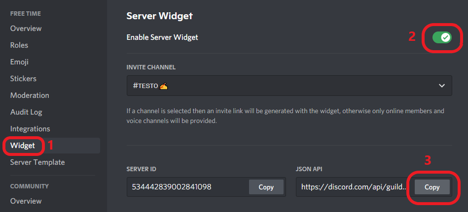

# Discord Invite Custom

A dynamic template to have a unique invitation page to your discord server!

---

#### Live Demo:

You can test the it on [THIS SITE](https://ed0.it/freetime)!


---

#### Features:

- The online members will be displayed in the background

- Simple setup

- The site is responsive

###### Mobile example:


---

#### Configuration:

- Go to your server settings
- Follow the steps in the photo, in the order shown:



- Go to line 28 of **script.js** and replace *"https://discord.com/api/guilds/1234/widget.json"* with the link you just copied

- Edit lines 3, 32 and 38 of **index.html** with your server data:

```html
<title>Server Name</title>

<h1 class="text">SERVER<br>NAME</h1>

<h2><span class="server">Server Name</span><br><span class="by">by </span><span class="name">Founder#1234</span></h2>
```

- Edit line 40 of **index.html** with the invitation link to your server:

```html
<a href="https://discord.com/invite/q773tGD"><button class="acceptBtn">Accept Invite</button></a>
```

- Upload the files to your site along with a png photo of your server icon, called "logo.png

- Done!


---


#### Credits:

This template was created by merging the ideas of these two developers and making some changes.

- [Meikel](https://codepen.io/UndeadIncluded)

- [Gtaunfairr](https://codepen.io/gtaunfairr)


---


#### Donation:

> ***Buy me a coffee*** *(PayPal)*:    [Ed0ardo](https:///paypal.me/ed0ardo)

> ***Buy me a coffee*** *(Binance Pay)*:    268880867

> ***Buy me a coffee*** *(Binance Wallet)*:    0x2a895d54c5249349a27183139d5975aa3518d573

> ***Buy me a coffee*** *(Trust Wallet)*:    0x825fFeB482BE713eA3bFea0F3B8c398813B65269

> ***Buy me a coffee*** *(CashApp)*:    $Ed0ardo
